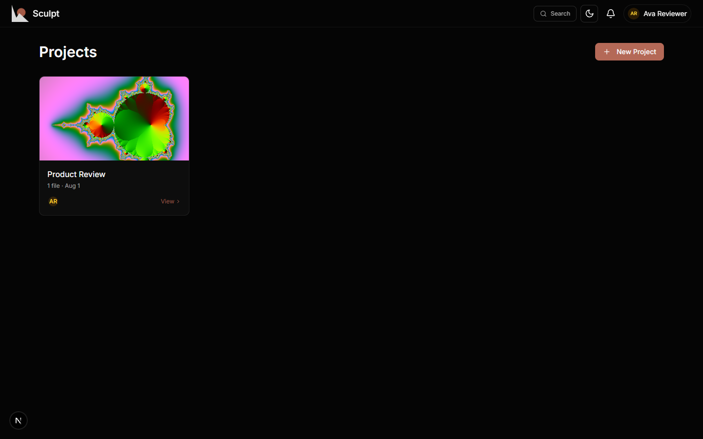
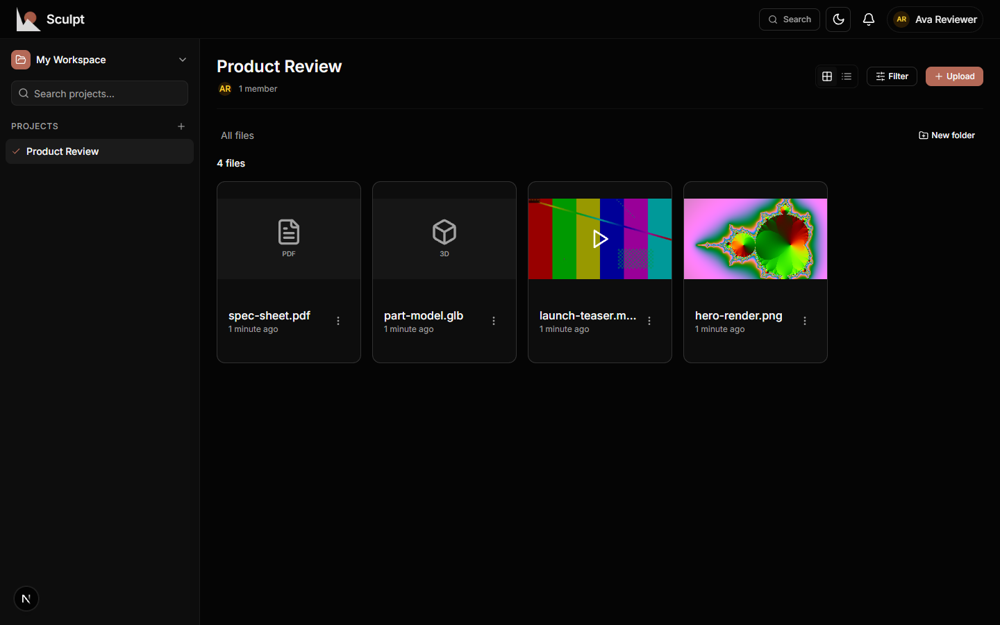
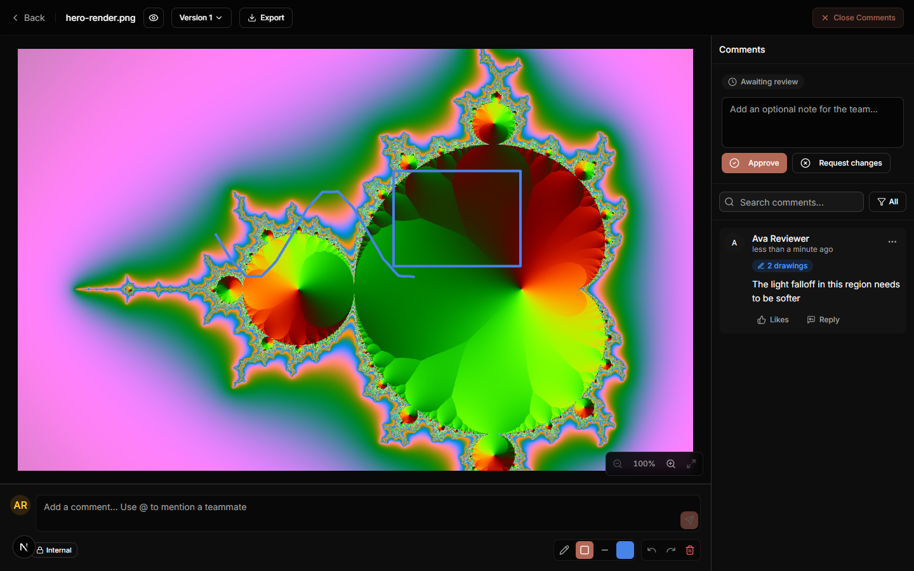
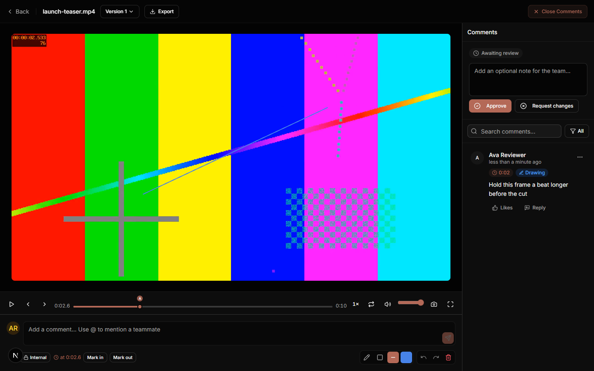
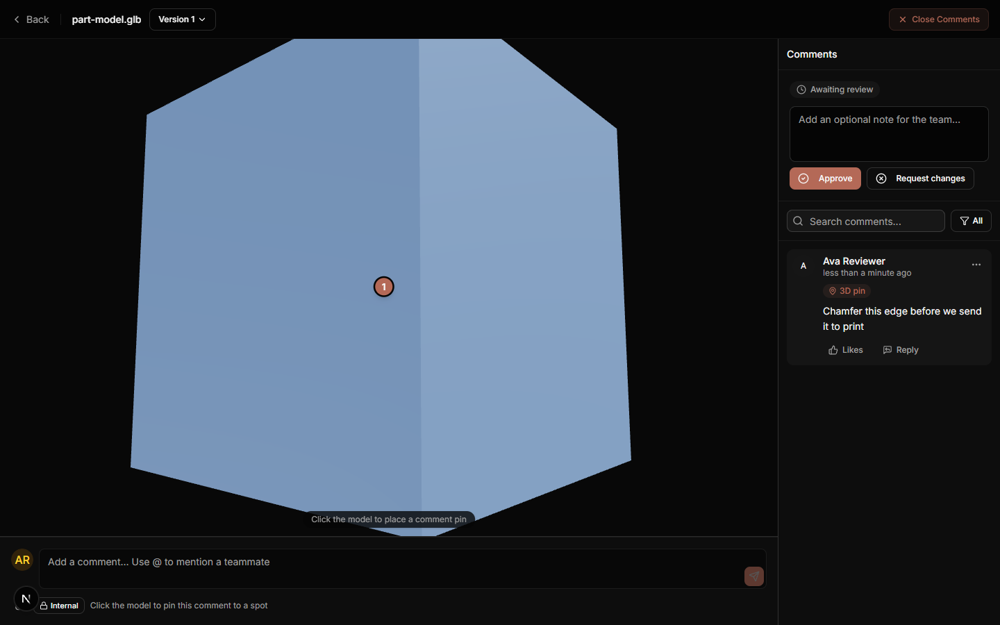
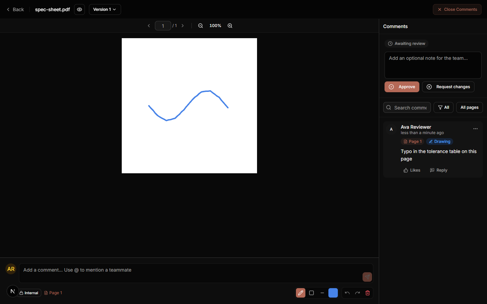

# Sculpt in action

Every capture on this page was taken from a real Sculpt instance driven end to
end in a browser — register, create a project, upload, annotate, comment — with
no mockups. To reproduce any of them, self-host Sculpt (four steps in the
[README](../README.md#quick-start-self-hosted)) and upload your own media.

## Projects and files

Projects group your media; every file card shows a live thumbnail, its review
status and how many versions it carries. Folders, bulk select, filters and
`Ctrl`/`Cmd`+`K` search keep large projects navigable.

## Image annotation

Draw directly on the image — pencil, rectangle or line, in nine colors — and
the strokes are saved with your comment. Selecting a comment in the sidebar
highlights exactly the drawings that belong to it.

## Video annotation

Pause on any frame and draw; the comment is anchored to that timestamp and
appears as a marker on the scrubber. Playback is frame-steppable with keyboard
shortcuts, speed control, looping and an annotated-frame PNG export. Uploads in
containers a browser cannot play (MKV, AVI, MXF, ProRes …) are transcoded to a
web-friendly rendition in the background while the original is kept.

## 3D model review

Orbit the model and click its surface to drop a numbered pin; the comment saves
the exact camera pose, and selecting it later flies every reviewer back to that
viewpoint without reloading the model. Sixteen formats (FBX, OBJ, STL, PLY,
DAE, 3MF, USDZ, …) are converted to GLB in the browser at upload time.

## PDF review

Page-by-page viewing with drawings and comments anchored to the page they were
made on — the sidebar can filter to the current page or show every page.

