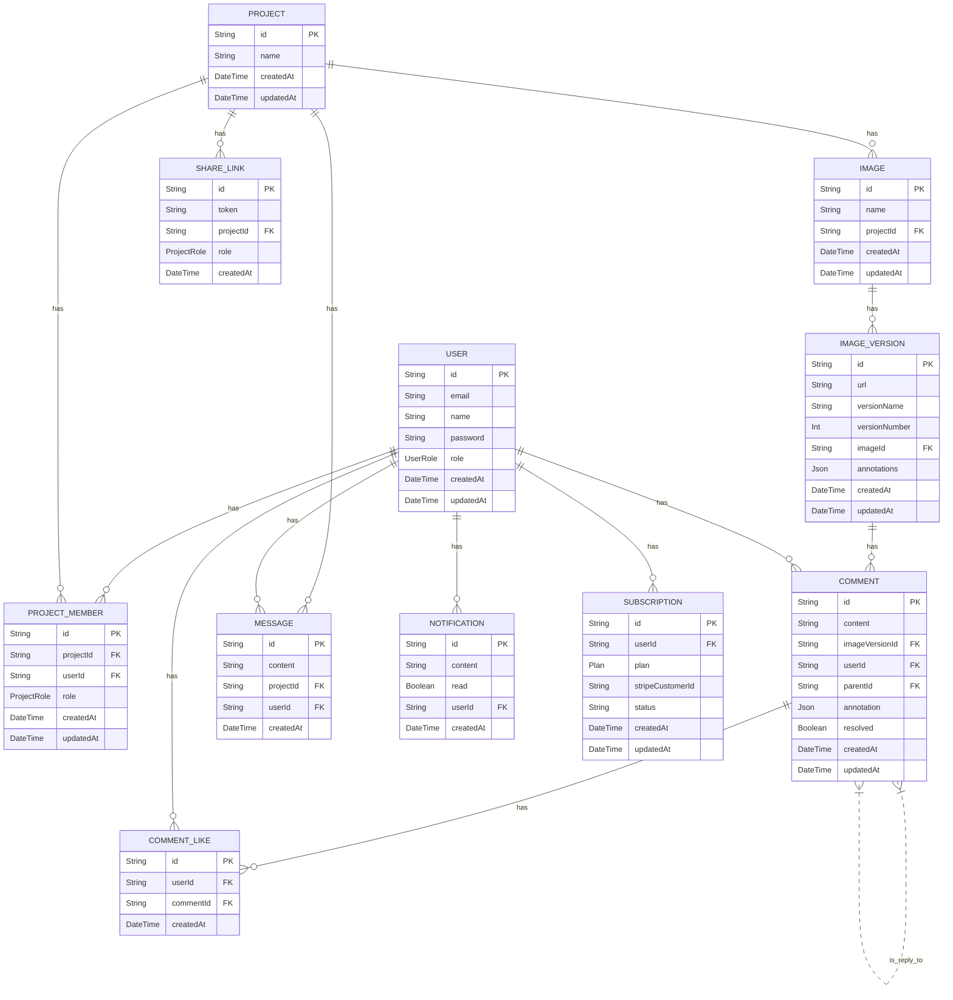

```mermaid
erDiagram
    USER {
        String id PK
        String email
        String name
        String password
        UserRole role
        DateTime createdAt
        DateTime updatedAt
    }

    PROJECT {
        String id PK
        String name
        DateTime createdAt
        DateTime updatedAt
    }

    PROJECT_MEMBER {
        String id PK
        String projectId FK
        String userId FK
        ProjectRole role
        DateTime createdAt
        DateTime updatedAt
    }

    IMAGE {
        String id PK
        String name
        String projectId FK
        DateTime createdAt
        DateTime updatedAt
    }

    IMAGE_VERSION {
        String id PK
        String url
        String versionName
        Int versionNumber
        String imageId FK
        Json annotations
        DateTime createdAt
        DateTime updatedAt
    }

    COMMENT {
        String id PK
        String content
        String imageVersionId FK
        String userId FK
        String parentId FK
        Json annotation
        Boolean resolved
        DateTime createdAt
        DateTime updatedAt
    }

    COMMENT_LIKE {
        String id PK
        String userId FK
        String commentId FK
        DateTime createdAt
    }

    MESSAGE {
        String id PK
        String content
        String projectId FK
        String userId FK
        DateTime createdAt
    }

    NOTIFICATION {
        String id PK
        String content
        Boolean read
        String userId FK
        DateTime createdAt
    }

    SUBSCRIPTION {
        String id PK
        String userId FK
        Plan plan
        String stripeCustomerId
        String status
        DateTime createdAt
        DateTime updatedAt
    }

    SHARE_LINK {
        String id PK
        String token
        String projectId FK
        ProjectRole role
        DateTime createdAt
    }

    USER ||--o{ PROJECT_MEMBER : has
    PROJECT ||--o{ PROJECT_MEMBER : has
    PROJECT ||--o{ IMAGE : has
    PROJECT ||--o{ MESSAGE : has
    PROJECT ||--o{ SHARE_LINK : has
    IMAGE ||--o{ IMAGE_VERSION : has
    IMAGE_VERSION ||--o{ COMMENT : has
    USER ||--o{ COMMENT : has
    COMMENT ||--o{ COMMENT_LIKE : has
    USER ||--o{ COMMENT_LIKE : has
    USER ||--o{ MESSAGE : has
    USER ||--o{ NOTIFICATION : has
    USER ||--o{ SUBSCRIPTION : has
    COMMENT }|..|{ COMMENT : is_reply_to
```

### Database Schema

This ERD shows the database tables and their relationships.