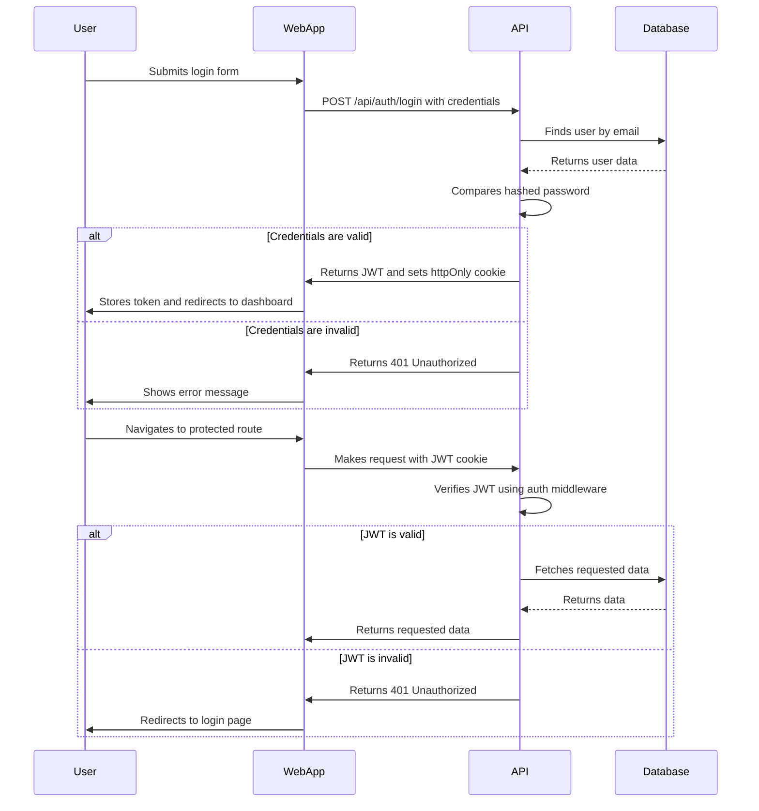

```mermaid
sequenceDiagram
    participant User
    participant WebApp
    participant API
    participant Database

    User->>WebApp: Submits login form
    WebApp->>API: POST /api/auth/login with credentials
    API->>Database: Finds user by email
    Database-->>API: Returns user data
    API->>API: Compares hashed password
    alt Credentials are valid
        API->>WebApp: Returns JWT and sets httpOnly cookie
        WebApp->>User: Stores token and redirects to dashboard
    else Credentials are invalid
        API->>WebApp: Returns 401 Unauthorized
        WebApp->>User: Shows error message
    end

    User->>WebApp: Navigates to protected route
    WebApp->>API: Makes request with JWT cookie
    API->>API: Verifies JWT using auth middleware
    alt JWT is valid
        API->>Database: Fetches requested data
        Database-->>API: Returns data
        API->>WebApp: Returns requested data
    else JWT is invalid
        API->>WebApp: Returns 401 Unauthorized
        WebApp->>User: Redirects to login page
    end
```

### Authentication Flow

This sequence diagram illustrates the user authentication process.